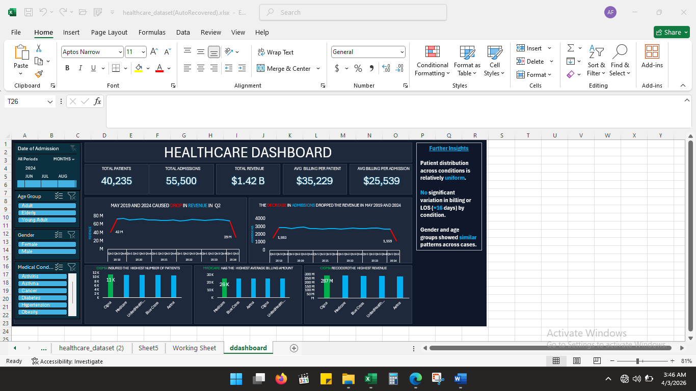

🏥 Healthcare Data Analysis Dashboard

📌 Project Overview
This project analyzes a healthcare dataset spanning 2019–2024 to uncover trends in hospital admissions, patient billing, and revenue performance.The findings are presented through a dark-themed, interactive Excel dashboard designed for clarity and executive-level reporting.

🎯 Objective
To explore patterns in hospital admissions and revenue performance over time, and present findings through a structured, interactive dashboard that enables quick insights without requiring technical expertise.

 🛠 Tools & Skills Used
- Microsoft Excel 
- Power Query (Data Cleaning & Transformation) 
- Pivot Tables 
- Data Visualization 
- Dashboard Design 
- Data Cleaning Techniques 

📂 Dataset
Healthcare dataset (Sourced from Kaggle)

 📊 Dashboard Features
The dashboard includes:
- KPI Cards — Snapshot of total revenue, total admissions, and other headline metrics
- Revenue Trend Analysis — Line chart tracking revenue performance over time
- Admission Trend Analysis — Visualizing patient admission patterns across periods
- Interactive Slicers — Filter by Date of Admission, Month, Age Group, Gender, and Medical Condition
- Charts & Visualizations— Clean, readable charts designed for clarity and impact

📊 Key Insights
- May 2019 and 2024 both caused a notable drop in Q2 revenue, linked directly to a decrease in admissions
- Patient distribution across conditions is relatively uniform , no single condition dominates
- No significant variation in billing or length of stay (LOS) by condition
- Gender and age groups showed similar patient distribution across cases

📸 Dashboard Preview

🚀 What I Learned
- How to clean and transform healthcare data using Power Query
- How admission trends directly impact revenue — correlation storytelling
- How slicers improve interactivity and user experience
- The importance of concise insight labels directly on the dashboard
  
🔗 Project Files
- Dataset (CSV) 
- Excel Dashboard File 
- PDF Version of Dashboard 

📌 Conclusion
This project strengthened my ability to work with real-world healthcare data and reinforced the importance of combining technical data skills with domain knowledge to generate meaningful insights.

👤 Author

Folorunsho Ayomide 
Physiotherapy Intern | Aspiring Data Analyst 
[LinkedIn](https://www.linkedin.com/in/ayomide-folorunsho-714728254?utm_source=share&utm_campaign=share_via&utm_content=profile&utm_medium=android_app)
[GitHub](https://github.com/folorunshoayomide)

